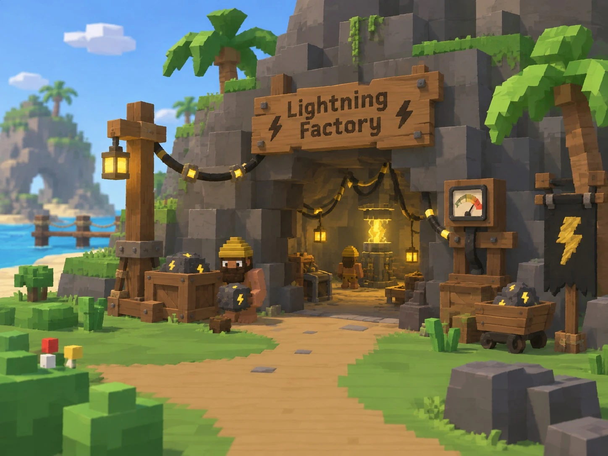
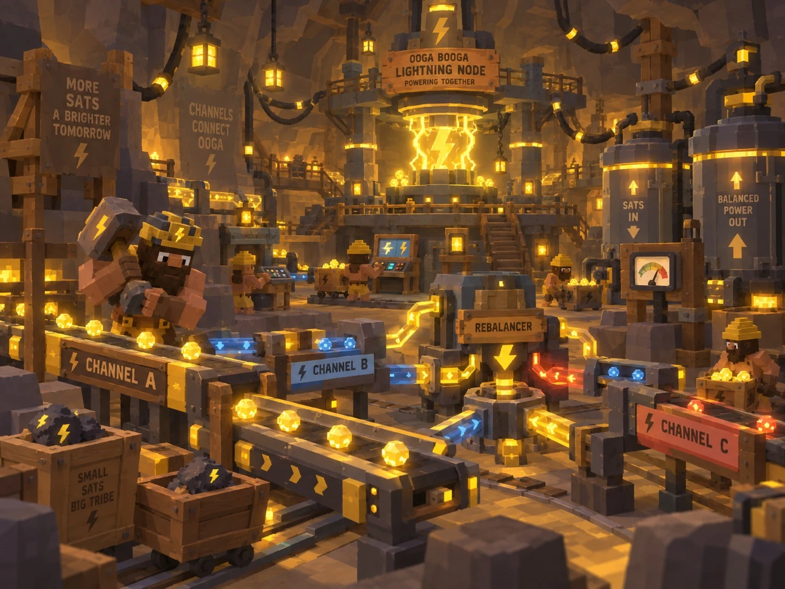

# Ooga Booga Land

Foundry runs and learns from Lightning. Ooga Booga Land (OBL) makes that activity visible,
understandable and social.

The two projects reinforce each other without depending on each other. Foundry is useful with
no cave at all; OBL is a separate project with its own schedule and its own repository. What
they produce together is something neither has alone — real autonomous Lightning
infrastructure with a living world around it, and a path from curiosity to running a node.

## The loop

```text
                 LIGHTNING FOUNDRY
                        │
        operates + learns + optimizes
                        ▼
                OBL Lightning Node
                        │
             real economic activity
       donations / games / routing / payouts
                        ▼
              public Foundry events
                        ▼
              Lightning Factory Cave
                        │
          visualizes + teaches + attracts
                        ▼
                     OBL Community
                        │
            users / contributors / nodes
                        └──────► Foundry
```

The last arrow is the point. Someone meets Lightning through a game, watches a gorilla build
a channel, learns why a rebalance happened, finds Foundry, contributes, runs a node — and may
eventually connect that node back to the ecosystem.

OBL also gives Foundry something no simulator can: **a real node with real economic
activity** to operate, rather than a synthetic demo.

## The boundary

Permanent, and not a matter of configuration:

- The cave **consumes exported events**. It is a reader.
- It **never holds a Lightning credential** and **never controls LND**.
- It receives **only what the public schema can express**
  ([`foundry-public-event.v1`](../../schemas/foundry-public-event.v1.schema.json)), which is a
  different document from the internal contract rather than a redacted copy of it.
- Publishing is **opt-in per operator**, always.

This is why the public schema exists in the shape it does. A visualization is, by definition,
something strangers watch.

## Concept art

Design anchors from the OBL team, not specifications.

### Entrance



A cave mouth in the island cliff under a **Lightning Factory** sign, lanterns and cabling
strung across the rock, crates and a minecart of bolt-marked ore, a gauge on a post, and a
glowing core visible inside. A worker waits outside.

The entrance carries one piece of live state well: whether the factory is **lit or dark**,
which maps cleanly to `node.started` / `node.ready` / `node.stopped`. A visitor can tell from
the path whether the node is up.

### Interior



A cavern under an **OOGA BOOGA LIGHTNING NODE — POWERING TOGETHER** sign. A glowing core in
the center. Conveyor lines labeled **CHANNEL A**, **CHANNEL B**, **CHANNEL C** carrying gold
sats with directional arrows. A **REBALANCER** machine between them. Storage cylinders marked
**SATS IN** and **BALANCED POWER OUT**. Gorilla NPCs in hard hats working stations and pushing
carts. Tribe signage on the walls.

## Event mapping

What the public schema supports directly:

| Factory behavior | Public event |
|---|---|
| Factory lit / dark | `node.started` / `node.ready` / `node.stopped` |
| Gorillas build a new production line | `channel.opening` |
| Line powers up | `channel.active` |
| Sats move along a line | `forward.settled` (bucketed count and scale) |
| A line sputters, sats jam | `forward.failed` |
| Gorillas dismantle a line | `channel.closing` / `channel.closed` |
| Gorillas run the REBALANCER | `rebalance.succeeded` / `rebalance.failed` — hourly, no line |
| More lines in the hall | `channel_count` |
| Busier or quieter factory | `activity.summary`, `success_ratio` |

Note what the public feed does **not** carry: the failure *reason*. A line can visibly
struggle; it cannot reveal that it struggled because it ran dry.

## Rebalancing: published, and what that costs

**Decision: rebalance events are published**, so the REBALANCER in the interior art is driven
by the real node. This section records the risk that accepts, because rebalancing is the one
public event that touches liquidity, and liquidity is what the rest of the public schema
exists to withhold.

### The constraints that make it tolerable

Four are enforced by the schema, so no export can violate them, and the contract tests check
each against the schema itself:

- **No line attribution.** A rebalance event cannot carry a `slot`. Gorillas service the
  machinery; the feed never says which production line was low.
- **Hourly buckets.** A rebalance is placed in its hour, never its minute.
- **No success rate.** A rebalance event cannot carry `success_ratio`, which would summarize
  how often the node failed to find liquidity.
- **Bucketed scale, no fee.** Rough size only; what the rebalance cost is never published.

Two are the export's job, because no schema can express them:

- **Released at the close of its hour.** Events are held and emitted after everything else
  from that hour. Without this, a rebalance labeled "sometime this hour" but emitted the
  instant it happened would be timed exactly by its position in the stream — the bucket would
  be decoration. The contract tests check that the examples follow it.
- **Random public ids.** The schema requires the UUIDv4 format; generating each one at random,
  and never reusing an internal id, is up to the export. Time-ordered ids embed a millisecond
  timestamp and would undo the bucketing on their own.

### The risks that remain

These are not closed by the constraints. They are the price of animating the rebalancer from
real data, and they are accepted deliberately rather than by accident.

1. **Every rebalance confirms depletion.** A rebalance means some channel ran low that hour.
   Over weeks, the frequency becomes a profile of the node's liquidity stress — when it
   struggles, how often, how badly.

2. **It gives a jamming adversary a feedback loop.** This is the most concrete risk. An
   attacker jams the node, then watches the Factory. Rebalance counts climbing after the attack
   confirm it worked. Hourly bucketing slows the loop to one reading per hour; it does not
   break it, because an attacker can run hour-long experiments. The feed becomes a dashboard
   for tuning an attack.

3. **Correlation reconstructs attribution.** `forward.failed` *does* carry a `slot`, at minute
   resolution. A line that fails forwards at 17:44, followed by a rebalance in the 17:00
   bucket, is very likely the line that was rebalanced. The schema withholds the attribution
   from the rebalance event; the neighboring event partly gives it back. The failure reason is
   never published, which weakens the inference, but does not remove it.

4. **Failed rebalances advertise weakness.** `rebalance.failed` says the node needed liquidity
   and could not get it — that it is stuck. It is the most actionable signal in the feed for an
   attacker or a competitor.

5. **Operating cost is partly visible.** Rebalance volume, even bucketed, lets a competitor
   estimate what the node spends keeping itself usable.

6. **Multi-node rooms multiply it.** When several operators publish into the Factory, the
   timing of their rebalances becomes correlatable across nodes, and circular rebalancing
   routes between participants may become visible. A single-node feed does not have this
   problem; the longer-term vision does.

7. **It is permanent.** Published and archived data cannot be withdrawn, and a liquidity
   profile grows more valuable to an adversary the longer it accumulates.

### Further mitigations, if wanted

Each trades animation fidelity for exposure. None is required by the current decision:

- **Publish successes only.** Dropping `rebalance.failed` removes risk 4, the most actionable
  one, at the cost of never seeing gorillas fail at the machine. The strongest single option.
- **Break the correlation.** Coarsen `forward.failed` to the hour, or drop its `slot`. Removes
  most of risk 3, at the cost of no longer showing which line jammed.
- **Daily rather than hourly.** A single daily count slows the jamming feedback loop from
  hourly to daily, which makes risk 2 far less useful to an attacker.

**For the node holding real donations, publishing successes only is worth serious
consideration.**

## Still open

### The tanks

**SATS IN** and **BALANCED POWER OUT** cylinders imply fill levels, and a tank that visibly
empties is a liquidity gauge — the same exposure as above, in a far more legible form, and not
covered by the rebalancing decision.

Suggestion: drive tank levels from **throughput** (how much moved recently) rather than
**balance** (how much remains). Visually similar, and throughput is already published.

### Channel color

Channel C is red. If color encodes **health or liquidity**, it leaks balance state. If it
encodes **identity** — arbitrary per line — it leaks nothing. Failure *rate* is publishable,
so "this line is struggling" is fine; "this line is low on outbound" is not.

Line labels should be rendered from the public schema's opaque `slot`, which rotates daily at
00:00 UTC and is explicitly **not** a stable identifier. A label that persists across
rotations lets an observer correlate activity to one channel over time.

## OBL's side of delivery

Foundry secures the path from the node to OBL — outbound-only, encrypted, authenticated,
signed. See the Delivery section of [`event-model.md`](../event-model.md). The receiving end is
OBL's to build, and it needs a backend: OBL is served by GitHub Pages, which serves files and
cannot accept a POST.

### What exists today

Surveyed September 2026:

- **[Oogatron](https://github.com/rules-without-rulers/oogatron)**, the one deployed backend
  in the ecosystem: a Cloudflare Worker with a D1 database, a KV cache and a one-minute cron,
  serving the contributor stats the page polls every minute. It already accepts one
  server-to-server POST, authenticated by a bearer token compared in constant time. It lives
  in a contributor's own repository and runs at a `workers.dev` address, not under OBL's
  domain.
- **A backend foundation for Zuzu**, the talking NPC in DSB Land, in OBL's
  [`server/zuzu/`](https://github.com/OogaBoogaX/oogaboogaland/blob/rock/server/zuzu/README.md):
  a runtime-neutral request handler with strict validation, size and rate limits, and secrets
  held only on the server. It is written for a Cloudflare Worker and not yet deployed; its
  plan routes `/api/*` on OBL's own domain to that Worker.
- **Payments are still a simulator.** The donation adapter in OBL's payments proof of concept
  — record each settled payment once, update the pile — does not exist yet, and it has the
  same shape as the Factory's ingest: verify a signed POST, ignore repeats, update browsers.

### What the Factory needs

One Worker with D1, owned by OBL, on the stack the team already runs:

- **`POST /api/factory/ingest`** takes the node's scheduled batches. It checks the per-node
  credential and the batch signature, stores each event once, keyed by node and `seq`, so a
  resent batch changes nothing, and answers with the highest `seq` it has accepted.
- **`GET /api/factory/events?after=<seq>`** is what browsers poll, once a minute like the
  contributor stats. The data is public and the same for every visitor, so it caches at the
  edge, and because the feed arrives in minute batches, a live socket would buy nothing.

The same Worker can later take BTCPay's signed webhooks for the donation adapter, and host
Zuzu's chat route. Browsers read the feed from OBL, never from a node: the node listens on
nothing, and a visitor's browser should not learn where it is.

### Before it is built

- **Pinning.** Cloudflare terminates TLS with certificates it rotates on its own schedule,
  so the node cannot pin them. It validates them the ordinary way instead, and the batch
  signature is what makes a forged batch fail. If OBL ever serves the ingest with a key it
  controls, the node pins that key; see rule 2 of the Delivery section in
  [`event-model.md`](../event-model.md).
- **Ownership.** The Worker decides what the Factory shows and, once donations run through it,
  what the pile credits. It belongs in a Cloudflare account the team controls jointly, not in
  anyone's personal one.
- **Not on the node's machine.** The ingest accepts connections and the node accepts none. The
  proof of concept's spare hardware runs the node, so the ingest runs somewhere else.

### The browser leg

OBL's to secure. The page's content policy already allows `connect-src https: wss:`, an owner
decision so the page can reach its live feeds — mempool data, chain and price snapshots,
contributor stats. Serving the Factory feed under OBL's own domain keeps it same-origin.
Naming each origin rather than admitting every secure one would be the tighter policy; that
trade-off is OBL's to make.

## Where the work lives

- **Foundry** owns the event contract and this integration's constraints.
- **OBL** owns the cave: geometry, NPCs, animation, the scenes that hold them, and the ingest
  endpoint that feeds them. The implementation ships on OBL's schedule and is not a gate on
  any Foundry milestone.

Foundry emits `channel.opening`. OBL decides that gorillas build a production line. Neither
repository decides the other's half.

## Longer term

Additional operators' nodes as separate rooms or workshops in the Factory, each showing only
what its operator chose to publish, with real relationships between nodes drawn as tunnels or
cabling. That raises the stakes on everything above: a multi-node public feed multiplies every
leak, and the questions in this document want settling before a second node appears.

## Related

- [`obl-payments-poc.md`](obl-payments-poc.md) — OBL's payments and Lightning Factory proof of
  concept, mapped onto the milestones.
- `../lightning-factory.md`, not yet written — the consumer's side of the contract: what the
  Factory must do with the stream it receives.
